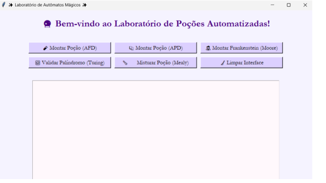
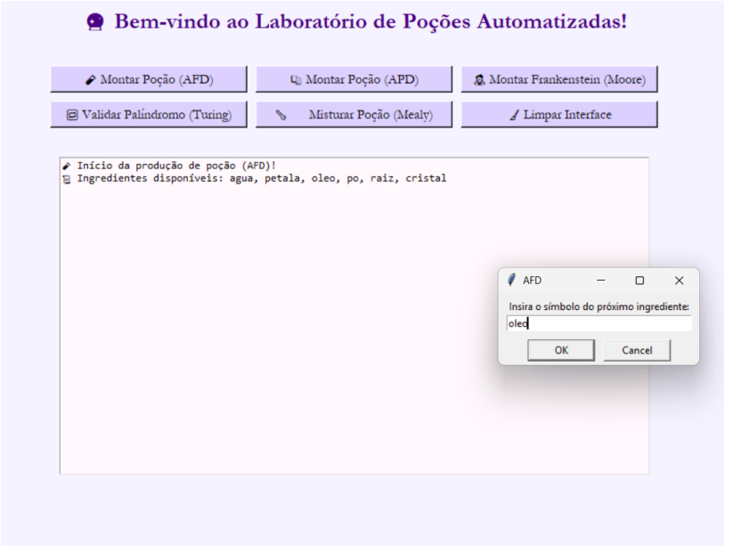
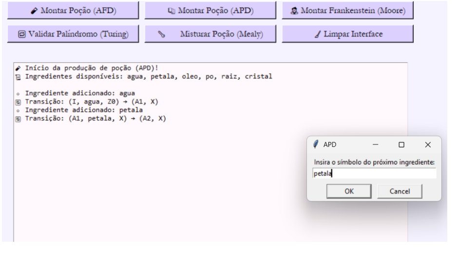
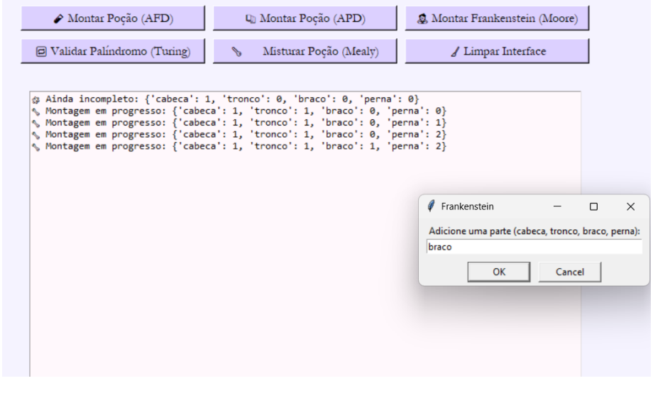
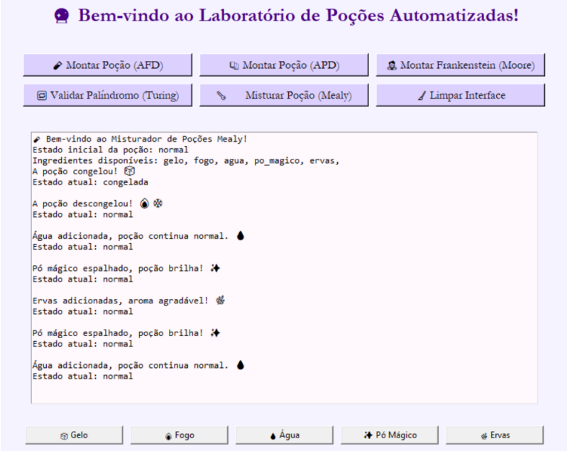

# Laboratorio de Pocoes Magicas - Automatos e Computacao

Este projeto foi desenvolvido como Trabalho Pratico 3 da disciplina de Fundamentos da Teoria da Computacao (CCF 131) na Universidade Federal de Vicosa (UFV) - Campus Florestal. O objetivo principal foi aplicar conceitos de automatos e modelos computacionais em um contexto ludico e criativo: a producao automatizada de pocoes magicas.

## 1. Descricao do Projeto

O sistema simula um laboratorio de pocoes magicas onde o usuario pode interagir com diferentes tipos de automatos para verificar receitas, misturar ingredientes e criar pocoes. Cada automato representa um modelo computacional distinto, permitindo explorar na pratica as capacidades e limitacoes de cada um.

Foram implementados:

- **AFD (Automato Finito Deterministico)** - Obrigatorio
- **APD (Automato com Pilha)** - Obrigatorio
- **Maquina de Mealy** - Extra
- **Maquina de Moore** - Extra
- **Maquina de Turing** - Extra
- **Interface Grafica Interativa** - Extra

O projeto conta com uma interface tematica que simula um verdadeiro Laboratorio de Pocoes Magicas, onde o usuario pode visualizar mensagens, reacoes da mistura e acompanhar todo o processo de forma intuitiva e envolvente.

## 2. Tecnologias Utilizadas

| Tecnologia | Descricao |
|------------|-----------|
| **Python** | Linguagem de programacao principal |
| **Tkinter** | Biblioteca para criacao da interface grafica |
| **Graphviz** | Visualizacao de diagramas de estados e transicoes |
| **Arquivos .txt** | Definicao dos automatos (AFD e APD) |


## 3. Ingredientes Utilizados

Foram definidos 6 ingredientes principais, cada um representado por um simbolo textual:

| Ingrediente | Simbolo |
|-------------|---------|
| Agua | agua |
| Petala | petala |
| Oleo | oleo |
| Po de fada | po |
| Raiz magica | raiz |
| Cristal | cristal |

## 4. Automatos Implementados

### 4.1 AFD (Automato Finito Deterministico)

O AFD processa ingredientes de uma pocao de acordo com uma sequencia valida predefinida. A maquina e alimentada por um arquivo .txt contendo sua descricao formal, com estados, transicoes e alfabeto.

**Funcionamento:**
- Leitura do arquivo de configuracao
- Transicoes baseadas no estado atual e simbolo lido
- Verificacao ao final se o estado e final (pocao criada com sucesso)

### 4.2 APD (Automato com Pilha)

O APD simula um automato de pilha deterministico, capaz de processar sequencias de ingredientes e simular reacoes empilhadas na "pilha magica".

**Funcionamento:**
- Leitura do arquivo de configuracao
- Utilizacao de pilha para controle de contexto
- Transicoes considerando estado, simbolo e topo da pilha
- Aceitacao quando estado final e pilha vazia

### 4.3 Maquina de Mealy (Extra)

Simula visualmente a mistura de ingredientes, respondendo a cada ingrediente inserido com mensagens magicas e alterando o estado da pocao.

**Caracteristica:** A saida depende do estado atual E do ingrediente inserido.

### 4.4 Maquina de Moore (Extra)

Aplicada a montagem de um monstro Frankenstein, onde o estado depende das partes ja adicionadas e a saida esta associada diretamente ao estado.

**Caracteristica:** A saida depende APENAS do estado atual.

**Partes do monstro:**
- Cabeca (1x)
- Tronco (1x)
- Bracos (2x)
- Pernas (2x)

### 4.5 Maquina de Turing (Extra)

Implementa uma maquina de Turing deterministica para verificar se uma palavra de entrada e um palindromo.

**Funcionamento:**
- Fita com simbolos de entrada
- Cabecote de leitura/gravacao
- Estados que determinam o comportamento
- Marcacao de simbolos comparados (X)

## 5. Interface Grafica

A interface foi desenvolvida com Tkinter e simula um laboratorio magico com:

- Botoes para acionar cada tipo de automato
- Area de texto que simula um "relatorio de laboratorio"
- Dialogos para insercao de ingredientes
- Exibicao de imagens tematicas
- Botao de limpeza para reiniciar o ambiente

## 6. Screenshots da Interface

### Tela Inicial do Laboratorio

*Interface principal do laboratorio de pocoes magicas*

### Selecionando Ingredientes no AFD

*Adicionando ingredientes para criar uma pocao no AFD*

### APD em Funcionamento

*Processamento de ingredientes com pilha magica*

### Montando o Frankenstein (Moore)

*Construindo o monstro parte por parte*

### Maquina de Mealy

*Transicoes e mensagens a cada ingrediente*


## 7. Execucao via Terminal

### Comandos para testes no terminal:

```bash
# Executar AFD
python -m testes.testAfd

# Executar APD
python -m testes.testApd

# Executar Maquina de Moore
python -m testes.testMoore

# Executar Maquina de Mealy
python -m testes.testMealy

# Executar Maquina de Turing
python -m testes.testTuring

```

### Comando para teste na interface: 

```bash
python -m interface.app